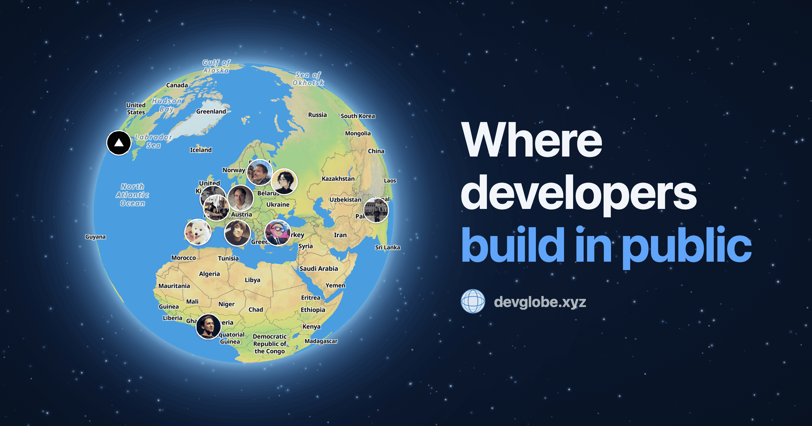

<h1 align="center">DevGlobe — Extensions</h1>

<p align="center">
  <strong>Show up on a 3D globe in real time while you code.</strong><br/>
  Official extensions for <a href="https://devglobe.app">devglobe.app</a>
</p>

<p align="center">
  <a href="https://github.com/Nako0/devglobe-extension/stargazers"></a>&nbsp;
  <a href="https://plugins.jetbrains.com/plugin/30572-devglobe"></a>
</p>

<p align="center">
  <a href="#vs-code">VS Code</a> &nbsp;·&nbsp;
  <a href="#jetbrains">JetBrains</a> &nbsp;·&nbsp;
  <a href="#zed">Zed</a> &nbsp;·&nbsp;
  <a href="#neovim">NeoVim</a> &nbsp;·&nbsp;
  <a href="#claude-code">Claude Code</a> &nbsp;·&nbsp;
  <a href="#codex">Codex</a> &nbsp;·&nbsp;
  <a href="#opencode">OpenCode</a>
</p>

<p align="center">
  <a href="https://devglobe.app">
    
  </a>
</p>

---

## Why DevGlobe?

DevGlobe is a **free, open-source** platform for developer metrics, insights and time tracking — automatically generated from your coding activity. Every developer lights up a live marker on a worldwide 3D globe while coding, and gets a public profile that showcases their stats, projects and links.

| Visibility | Networking | Motivation | Projects |
| --- | --- | --- | --- |
| Your own public profile with your GitHub, X, projects and links. A shareable page that shows what you're building. | See who's coding right now and in which language. Click a marker to open a developer's profile and projects. | Track your coding time, streaks and badges. Your stats keep you coming back. | Publish your projects with tech stack and teammates. Get discovered, upvoted and discussed by the community. |

---

## Quick Start

```
1. Sign in on devglobe.app with GitHub, X (Twitter), or Google
2. Copy your API key from the profile settings
3. Install the extension in your IDE and paste the key
```

**That's it — your marker appears on the globe.**

The extension sends a heartbeat every 30 seconds while you code. Stop typing for 1 minute and heartbeats pause. After 10 minutes of inactivity, you disappear from the globe.

All extensions read your API key from `~/.devglobe/config.toml` and let you toggle local privacy flags (`hide_file_names`, `hide_branch_names`, `hide_project_names`) there. Globe-side visibility (anonymous mode, repo sharing, profile mode) is managed on [devglobe.app/dashboard/settings](https://devglobe.app/dashboard/settings).

---

## Supported IDEs

### VS Code

#### Installation

1. Install from the [VS Code Marketplace](https://marketplace.visualstudio.com/items?itemName=devglobe.devglobe)
2. Open the **DevGlobe** sidebar (globe icon in the activity bar)
3. Paste your API key → **Connect**

#### Sidebar

- **Login** — masked API key field + link to get your key on devglobe.app
- **Dashboard** — live coding time, active language, status message, start/stop tracking, disconnect

#### Commands

Available from the Command Palette (`Ctrl+Shift+P` / `Cmd+Shift+P`):

- `DevGlobe: Set Status Message`
- `DevGlobe: Show Coding Time`
- `DevGlobe: Open Globe`

#### Compatibility

- VS Code **1.80+** — also works with **Cursor**, **Windsurf**, **VSCodium**, **Positron**, **Antigravity** and other VS Code forks
- Zero external dependencies

---

### JetBrains

Compatible with **all JetBrains IDEs**: IntelliJ IDEA, WebStorm, PyCharm, GoLand, Rider, PhpStorm, CLion, RubyMine, DataGrip, Android Studio, RustRover.

#### Installation

1. Install from the [JetBrains Marketplace](https://plugins.jetbrains.com/plugin/30572-devglobe) or download the `.zip` from the [Releases](https://github.com/Nako0/devglobe-extension/releases)
2. For manual installation: **Settings → Plugins → ⚙️ → Install Plugin from Disk**
3. Open the **DevGlobe** tool window (right sidebar)
4. Paste your API key → **Connect**

#### Compatibility

- IDE builds **242 — 263.\*** (2024.2 to 2026.3)
- Java 17+

---

### Zed

> **Pending review for the Zed marketplace** ([PR #5841](https://github.com/zed-industries/extensions/pull/5841)). Install manually as a dev extension for now.

#### Installation

**Option A — Standalone repo (recommended):**

```bash
git clone https://github.com/devglobe-xyz/zed-devglobe.git
```

In Zed: `Cmd+Shift+P` → "zed: install dev extension" → select the `zed-devglobe/` folder.

**Option B — From this repo:**

```bash
git clone https://github.com/Nako0/devglobe-extension.git
```

In Zed: `Cmd+Shift+P` → "zed: install dev extension" → select the `zed-extension/` folder.

On first activation, the extension downloads the matching `devglobe-core` binary for your platform from [GitHub Releases](https://github.com/Nako0/devglobe-extension/releases) (one-time, ~60 MB).

#### Setup

Create your config file:

```bash
mkdir -p ~/.devglobe
cat > ~/.devglobe/config.toml <<'EOF'
api_key = "devglobe_YOUR_KEY_HERE"
EOF
```

Open a project in Zed, trust the worktree when prompted, and start coding. You'll appear on the globe within 30 seconds.

#### Requirements

- Zed editor

---

### NeoVim

#### Installation

**lazy.nvim:**

```lua
{
  "Nako0/devglobe-extension",
  event = "BufEnter",
  build = "cd devglobe-core && npm install && npm run build",
  config = function()
    vim.opt.rtp:append(vim.fn.stdpath("data") .. "/lazy/devglobe-extension/neovim-plugin")
    vim.cmd("runtime plugin/devglobe.lua")
    require("devglobe").setup()
  end,
}
```

devglobe-core is built automatically on install. Requires Node.js 18+.

#### Setup

```vim
:DevGlobe setup devglobe_YOUR_KEY_HERE
```

Or create `~/.devglobe/config.toml` manually with `api_key = "..."`.

#### Commands

| Command                       | Description                            |
| ----------------------------- | -------------------------------------- |
| `:DevGlobe setup KEY`         | Configure your API key                 |
| `:DevGlobe status MSG`        | Set your status message                |
| `:DevGlobe today`             | Show your coding time today            |
| `:DevGlobe open`              | Open the globe at devglobe.app/space   |
| `:DevGlobe debug true\|false` | Toggle debug logging                   |
| `:DevGlobe log`               | Open `~/.devglobe/devglobe.log`        |
| `:DevGlobe config`            | Open `~/.devglobe/config.toml`         |

Visibility settings (anonymous mode, repo sharing on the live globe, profile mode) are managed on [devglobe.app/dashboard/settings](https://devglobe.app/dashboard/settings).

#### Requirements

- NeoVim 0.9+
- [Node.js](https://nodejs.org) 18+

---

### Claude Code

#### Installation

In Claude Code, run:

```
/plugin marketplace add Nako0/devglobe-extension
```

```
/plugin install devglobe@devglobe
```

After installing, **restart Claude Code** (`/exit`, then reopen) so the plugin and its commands are loaded.

#### Setup

```
/devglobe:setup YOUR_API_KEY
```

Get your API key at [devglobe.app](https://devglobe.app) — sign in, then open your **profile settings**.

#### Commands

| Command                        | Description                                   |
| ------------------------------ | --------------------------------------------- |
| `/devglobe:setup YOUR_API_KEY` | Configure the plugin with your API key        |
| `/devglobe:status MESSAGE`     | Set a status message on your DevGlobe profile |

---

### Codex

#### Installation

In Codex, run:

```
$skill-installer --repo Nako0/devglobe-extension --path codex-plugin
```

After installing, **restart Codex** so the skill and its hooks are loaded.

#### Setup

```
$devglobe setup YOUR_API_KEY
```

Get your API key at [devglobe.app](https://devglobe.app) — sign in, then open your **profile settings**.

This saves your key, installs heartbeat hooks, and enables the `codex_hooks` feature flag.

#### Commands

| Command                        | Description                                             |
| ------------------------------ | ------------------------------------------------------- |
| `$devglobe setup YOUR_API_KEY` | Configure the skill with your API key and install hooks |
| `$devglobe status MESSAGE`     | Set a status message on your DevGlobe profile           |
| `$devglobe check`              | Verify the installation                                 |
| `$devglobe uninstall`          | Remove DevGlobe hooks from Codex                        |

Visibility settings (anonymous mode, repo sharing on the live globe, profile mode) are managed on [devglobe.app/dashboard/settings](https://devglobe.app/dashboard/settings).

#### Requirements

- [Codex CLI](https://github.com/openai/codex)
- [Node.js](https://nodejs.org) 18+

---

### OpenCode

#### Installation

Add the plugin to your `opencode.json`:

```json
{
  "plugin": ["opencode-devglobe"]
}
```

OpenCode installs it automatically on startup via npm.

#### Setup

Restart OpenCode and ask:

```
setup devglobe with my key YOUR_API_KEY
```

Get your API key at [devglobe.app](https://devglobe.app) — sign in, then open your **profile settings**.

#### Commands

Just ask in natural language — the plugin registers tools that the AI agent calls on your behalf:

| What you say                  | Tool              | Description                       |
| ----------------------------- | ----------------- | --------------------------------- |
| "setup devglobe with key X"   | `devglobe_setup`  | Configure API key                 |
| "set my devglobe status to X" | `devglobe_status` | Set a status message on the globe |
| "check devglobe"              | `devglobe_check`  | Verify installation               |

Visibility settings (anonymous mode, repo sharing on the live globe, profile mode) are managed on [devglobe.app/dashboard/settings](https://devglobe.app/dashboard/settings).

#### Requirements

- [OpenCode](https://github.com/anomalyco/opencode)

---

## Privacy

> **100% open source. We never read your code.**

**What the extension sends to DevGlobe:**

- Programming language detected by the IDE
- Editor + operating system name
- Coding time (per heartbeat, every 30 s)
- Origin remote URL of your current git repo (when present)
- Branch name (when present)
- File path **relative to your repo root** — never the absolute home path
- Status message (only what you set explicitly)

**What the extension never sends:**

- Source code, file contents, keystrokes
- Files outside any git repository (no path leaks for scratch files / local folders)
- Commit messages, environment variables, SSH keys

**Local privacy flags** — edit `~/.devglobe/config.toml`:

```toml
api_key = "YOUR_API_KEY"

[privacy]
hide_file_names = false       # omit the file field
hide_branch_names = false     # omit the branch field
hide_project_names = false    # omit repo + branch (project-level hiding implies branch hiding)
```

**Globe visibility** (anonymous mode, repo sharing on the live globe, profile mode) is managed on [devglobe.app/dashboard/settings](https://devglobe.app/dashboard/settings) — not in the extension.

**API keys** are stored in your OS keychain (VS Code SecretStorage, JetBrains PasswordSafe) or in a local config file under `~/.devglobe/` (Zed, NeoVim, Claude Code, Codex, OpenCode). Config files are created with `0600` permissions.

**Network:** HTTPS only (TLS 1.2+), no telemetry, no third-party trackers.

**[Read the full Privacy & Security documentation →](PRIVACY.md)**

---

## Contributing

Contributions are welcome — fixes, new features, documentation.

1. Fork the repository
2. Create your branch (`git checkout -b fix/something`)
3. Commit your changes
4. Open a Pull Request

---

## License

MIT

---

**[devglobe.app](https://devglobe.app)**
